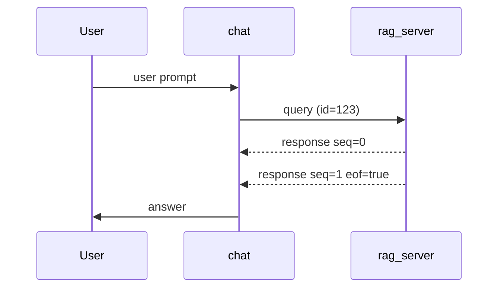

# Splinter Message Bus Protocol

_Splinter_ message bus is a shared‑memory, append‑only ring buffer that provides
loss‑tolerant, low‑latency communication between isolated components. Everything
— from IPC to LLM token, memory or context pipelines can travel through this
channel.

## 1. Transport Layer

- **Medium:** `mmap()`‑ed file (tmpfs by default). Size negotiable at launch.
- **Frame:** Each message is a single JSON object terminated by `\n`
  (newline‑delimited JSON, aka _ndjson_).
- **Atomicity:** Writers claim a slot, write, then flip a 1‑byte _ready_
  flag—visible via memory barrier to all readers.
- **Backpressure:** If the ring buffer is full, writers receive
  fault `4100 BACKPRESSURE`. They can retry with exponential back‑off or abort.
- **Security:** The buffer is mounted `noexec`, `nosuid`, and chmod `0600` by
  default. SELinux / AppArmor profiles encouraged but optional.

## 2. Envelope Schema

```jsonc
{
  "id": "2f5b7b20-8e0b-11ee-a1d4-0242ac120002", // UUID‑v7 preferred
  "ts": "2025-07-08T16:54:12.431Z", // RFC‑3339 UTC
  "ttl_ms": 5000, // optional; discard after expiry
  "from": "chat", // sender component id (name, PID, whatever)
  "to": "rag_server", // recipient id or "*" for broadcast
  "type": "query", // enum below
  "trace": "af-19bcbd6e", // optional trace/span id
  "seq": 0, // chunk sequence (0‑n) – omit if single frame
  "eof": true, // marks final chunk
  "payload": { // free‑form; schema set by `type`
    "text": "What are the 13 middot of Rabbi Ishmael?",
    "filters": { "corpus": "talmud", "book": "Berakhot" }
  }
}
```

### `type` Enum

| Type        | Direction | Description                     |
| ----------- | --------- | ------------------------------- |
| `query`     | → service | Request work / data             |
| `response`  | ← client  | Reply to a `query`              |
| `event`     | → \*      | Broadcast state change / update |
| `error`     | ↔         | Fault response (see §4)         |
| `heartbeat` | ↔         | Liveliness ping (no payload)    |

> **Note:** All messages MUST include `id`, `ts`, `from`, `type`, and `payload`.
> Other fields are optional.

## 3. Streaming Protocol

Large responses are chunked:

- `seq` starts at 0.
- `eof: false` on all but last chunk.
- Chunks MUST share the same `id`.
- Receiver reassembles in‑order; missing chunks after `ttl_ms` trigger
  fault `4200 STREAM_TIMEOUT`.

## 4. Fault Codes (`type: "error"`)

| Code | Symbol           | Recoverable | Description                                      |
| ---- | ---------------- | ----------- | ------------------------------------------------ |
| 1000 | `BAD_SCHEMA`     | ✖ (drop)    | Envelope missing required key or bad JSON.       |
| 1001 | `TTL_EXPIRED`    | ✔           | Message arrived after `ttl_ms`.                  |
| 2000 | `NOT_AUTHORIZED` | ✔           | Sender not allowed to address `to`.              |
| 3000 | `UNKNOWN_TYPE`   | ✖           | `type` not recognized by receiver.               |
| 4100 | `BACKPRESSURE`   | ✔ (retry)   | Ring buffer full.                                |
| 4200 | `STREAM_TIMEOUT` | ✔ (retry)   | Missing chunk(s) beyond `ttl_ms`.                |
| 5000 | `INTERNAL_ERROR` | ✔/✖         | Unspecified receiver fault; may trigger restart. |

Error payload template:

```jsonc
{
  "id": "<same as triggering message>",
  "ts": "2025-07-08T16:55:03Z",
  "from": "service_daemon",
  "to": "chat",
  "type": "error",
  "payload": {
    "code": 4100,
    "symbol": "BACKPRESSURE",
    "detail": "Ring buffer 95% full; retry in 50ms"
  }
}
```

## 5. Example: Chat → RAG → Chat

1. **Query** from `chat` to `rag_server`.
2. `rag_server` streams chunks `seq:0..n` with retrieved passages.
3. Final chunk `eof:true` triggers `chat` to forward context to the model.
4. Model’s answer returned as `response` back to `chat`.

Sequence diagram (Mermaid):



## 6. Versioning & Compatibility

- Envelope additions **MUST** be optional to maintain backward compatibility.
- Breaking changes require bus protocol major rev bump (`X.*.*`).
- Services negotiate via `event` message announcing supported versions on
  startup.

## 7. Security Notes

- Shared memory is protected by POSIX file perms; multi‑user setups should run
  under dedicated service accounts.
- Larger isolation (e.g., QEMU) recommended when mixing trust levels.

## 8. See Also

Originally, splinter was called "shmbus", when the minimal envelope protocol was
final enough to support both IPC and RPC style uses. A reference implementation
was branched off (which you can explore or use in shmbus/) prior to additional
things like persistence being added. If your main use case for splinter is IPC
and you don't need persistence or additional envelope base overhead - shmbus
might be more in-line with what you're after.

_“Contracts are promises in code. Keep them small and you keep them honest.”_
